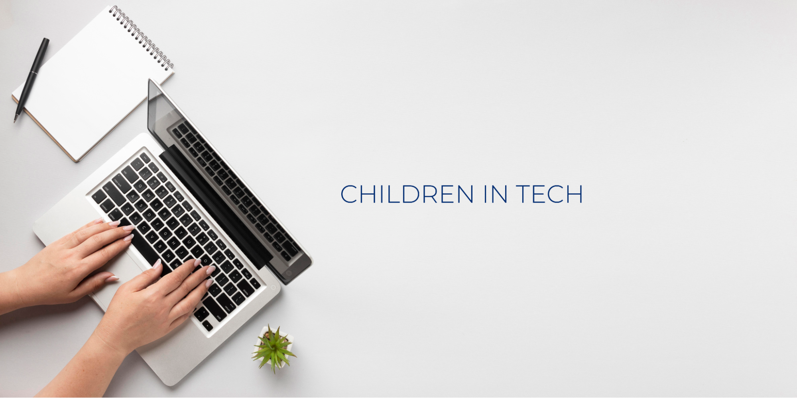

# [Children in Tech](https://childrenintech.com/)

> Non-profit Organization

`May 24 2021`

## Overview

Children in technology is an initiative to ignite the `problem solving` mindset of students below secondary level. As compared to an adult's brain, a child's brain is still developing, and as a result, malleable. When children are exposed to technology at high rates, their brain may adopt an internet approach to thinking – quickly scanning and processing multiple sources of information, problem solving capacity. With the right source and right guidance, children have made a positive impact in the technical arena.

Furthermore, Children in Technology mainly focuses on those children who are curious about technology and have the eagerness to contribute to the forum. Our main aim is to pave the road to childrens and link them directly to the technological world with keeping in mind, the `psychological` and `physical` aspect as well as `intellectual` and `emotional` development of theirs.

Children in Technology is developed in such a way that it takes care of small baby steps too while turning the dream into reality as we believe children are not supposed to compromise in anything beyond their brain development capacity.

## Goal

1.  To make childrens familiar with the latest technologies.
2.  To motivate them to learn technical stuff using `easier programming languages`.
3.  To enhance their `problem solving` skills through `cognitive behaviour`.
4.  To develop future `technological leaders`.

## Vision

- Creating art of `Critical Thinking` of children.
- Providing practical `STEM` based education for their eagerness and willingness to make their future path.

## Mission

- Encouraging Children to compete on the global marketplace at a very young age.
- Establishing `Emerging Technology` based Computer lab on every School nationally.
- Nationwide tech enriched `incubation labs`.
- Nationwide tech competition for k-12 students and make them ready for global.
- Introducing Nepal as a `Technological hub` and making Nepal a common global workplace.

## Tools and Technology

1. [`Blockly`](https://developers.google.com/blockly)
2. [`Scratch`](https://scratch.mit.edu/)
3. [`Lobe`](https://www.mayoclinic.org/brain-lobes/img-20008887)
4. [`Orange`](https://orangedatamining.com/)
5. [`MIT app inventor`](https://appinventor.mit.edu/)
6. [`Blockchain Explorer`](https://www.blockchain.com/explorer)
7. [`Canva`](https://www.canva.com/)

## Services

- Virtual Training and Physical Training
- Seminar and Workshops
- Codecamp and Bootcamp
- National and Int'l competitions
- Incubations

## Milestones

1. Virtual Training session

   > We focus on providing virtual training for students in a simulated environment using the latest technologies.We will collaborate with the school and provide our virtual training session through video conference.

2. [Web Application - Online Collaboration](https://childrenintech.com/)

   > An Open platform where both learning and teaching takes place. Collaborators and Developers add content to the web and students would learn the topic they want.

3. Mobile Application

   > Mobile Application is Similar to Web Application. Since Mobile is handy and accessible to all we will enroll maximum students via mobile application.

4. Seminar and Workshops

   > Different seminars and workshops will be organized to boost their knowledge and skills. How to improve coding skills in an easy way. Some fun activities that children will love to do. Tips and tricks to do any work in an interesting way.

5. Competitions

   > Different technological competitions would encourage students' participation in these technologies.

6. CIT based lab
   > Our another visionary program CIT based lab where every schools (private and public) of Nepal would be facilitated with our technology and volunteering skilled manpower.

# Syllabus

> Grade 9-10

## Programming - Blockly, Scratch -> JS (7 days/hour course)

> Basic Programming Concepts with their `use cases` and `applications`. Make Student clear with Visual Examples i.e games, app.

- Variable - 3 examples each
- Conditional - 3 examples each
- Looping - 3 examples each
- Function - 3 examples each
- Event - 3 examples each

> Final Project 2

## STEM - Blockly, Scratch (10 days/hours course)

> STEM education concept visualization through Visual Programming.

- Physics- 6 examples each
- Chemistry- 3 examples each
- Biology- 3 examples each
- Mathematics- 3 examples each
- Astronomy- 3 examples each
- Engineering - 3 examples

## Artificial Intelligence (AI)

Teach fundamentals of AI with visual effects. Applications and use cases of AI in this generation

- Image Classification
- Object Detection
- Natural language processing (NLP)
- Dataset Classification

[`Sentiment analysis by Peltarion`](https://peltarion.com/knowledge-center/documentation/get-started-with-the-platform)

    For the given paragraph, the model should predict the sentiment of that.

[`Orange`](https://orangedatamining.com/)

- Text classification/clustering
- Topic modeling

[`Knime`](https://docs.knime.com/)

- [ ] Need to go detaily

## Data Visualization

> `Under heavy construction`:construction:

### Overview of Data Visualization

1.  What is data visualization?
2.  Why is it important?
3.  Why do we need data visualization?
4.  How is data visualization used?

- Change over time
- Determining frequency
- Determining relationships (correlations)
- Examining a network
- Scheduling
- Analyzing value and risk

5.  Types of data visualization charts

- Line chart
- Area chart
- Bar chart
- Histogram
- Scatter plot
- Bubble chart
- Pie chart
- Gauge
- Map
- Heat map
- Frame diagram
- Sankey Diagram and so on..

6.  Reference
    - [`Orange`](https://orangedatamining.com/)
    - [`Visualize`](https://www.visualizefree.com/)

Made with :heart: by [Sanjay Magar](https://twitter.com/sanjmgr)
